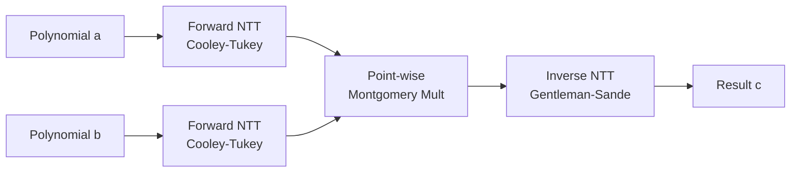
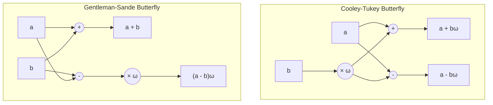
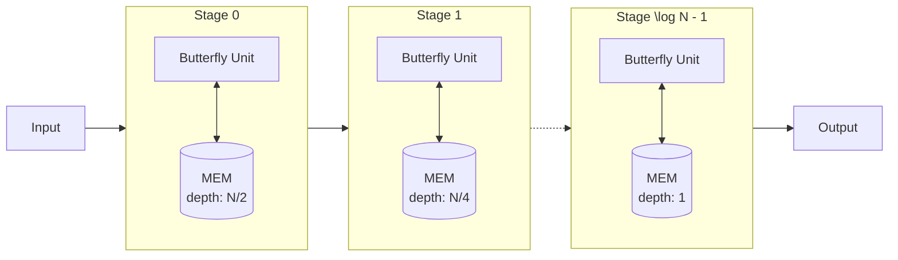

# Accelerating Post-Quantum Cryptography Algorithms on FPGA

Hardware implementation of Number Theoretic Transform (NTT) accelerators using Verilog. This repository provides architectural variants for computing NTT-based negacyclic convolution, targeting lattice-based cryptography applications such as Ring-LWE.

## Motivation & Problem Statement

Quantum computing threatens current cryptographic algorithms, driving the transition to Post-Quantum Cryptography (PQC), predominantly lattice-based schemes. The primary computational bottleneck in these algorithms is polynomial multiplication. While the Number Theoretic Transform (NTT) reduces the asymptotic complexity of polynomial multiplication, software implementations remain too slow for edge devices and high-throughput systems. 

This repository provides hardware acceleration for NTT on FPGAs, exploring the absolute operating limits of NTT hardware and establishing ideal tradeoffs between time (latency) and space (area).

## Mathematical Background

Polynomial multiplication in lattice-based cryptography is evaluated over a polynomial quotient ring $\mathbb{Z}_q[x]/(\phi(x))$. For $\phi(x) = x^n + 1$, this forms a Negative Wrapped Convolution (NWC).

Instead of computing the convolution in $O(n^2)$ time in the coefficient domain, the NTT evaluates the polynomials at $n$ distinct roots of unity in $O(n \log n)$ time. Multiplication is then performed component-wise in $O(n)$ time, followed by an Inverse NTT (INTT) to recover the coefficients.



## Hardware Architecture

The core of the NTT computation relies on the butterfly network. The forward transform utilizes the Cooley-Tukey (CT) butterfly, while the inverse transform applies the Gentleman-Sande (GS) butterfly. 



### Montgomery Modular Multiplication
To optimize the finite field arithmetic, the design operates in the Montgomery domain. All twiddle factors ($\omega$) are scaled, and multiplication with $R$ is performed to exit the Montgomery domain, reducing overall area consumption compared to standard division-based modulo reduction.

## Architectural Variants

The `src/` directory includes three distinct implementations targeting different points in the design space:

### 1. Pipelined Single Delay Feedback (SDF) (`ntt_single_delay_feedback_pipelined.v`)
A streaming architecture designed to minimize area while maintaining high throughput.
- **Space Complexity**: $O(\log N)$
- **Time Complexity**: $O(N)$
- **Performance**: Achieves an area reduction of nearly 20× compared to Toom-Cook and up to 75× compared to TMVP-5. Utilizing approximately 2400 LUTs at $N=256$, it maintains a constant throughput of 200M.
- **Resources**: Leverages block RAMs (BRAM) and DSP slices to ensure efficient scaling for large polynomials.



### 2. Fully Unrolled Combinational (`ntt_optimized_combinational.v`)
An architecture optimized for absolute minimum latency, flattening the butterfly network into a fully combinational path.
- **Space Complexity**: $O(N \log N)$
- **Time Complexity**: $O(\log N)$
- **Tradeoff**: Offers the highest raw throughput at the cost of a quasilinear growth in logic area.

### 3. Time-Multiplexed 3-Cycle (`ntt_time_multiplexed_3_cycle.v`)
A balanced approach utilizing a unified transform core multiplexed over 3 clock cycles.
- **Phase 0**: Evaluate `NTT(a)`
- **Phase 1**: Evaluate `NTT(b)`
- **Phase 2**: Compute `INTT(a ⊙ b)`
- **Tradeoff**: Maximizes core reuse for strict area constraints where pipelining is unnecessary.

## Directory Structure

```text
.
├── docs/                 # Documentation and research posters
│   ├── NTT.pdf
│   └── PQC_poster.pdf
├── src/                  # Verilog RTL source files
│   ├── ntt_optimized_combinational.v
│   ├── ntt_single_delay_feedback_pipelined.v
│   └── ntt_time_multiplexed_3_cycle.v
└── README.md
```

## Future Work: Radical Ring-LWE

Future iterations will transition from singular monolithic polynomials to a Module-LWE paradigm (Radical Ring-LWE), processing math as vectors of smaller rings.
- **Scalable Security**: Breaks the power-of-two constraint of standard Ring-LWE, allowing fine-grained security levels.
- **Linear Complexity**: Maintains linear scaling ($k$) with rank, unlike Module-LWE which scales quadratically ($k^2$), significantly reducing hardware overhead.

## Authors

**Pranay Arvind Patil** (24110252) - B.Tech 2024 ICDT  
**Vansh Goel** (24110379) - B.Tech 2024 EE  
Advisor: **Prof. Joycee Mekie**  
Indian Institute of Technology, Gandhinagar
